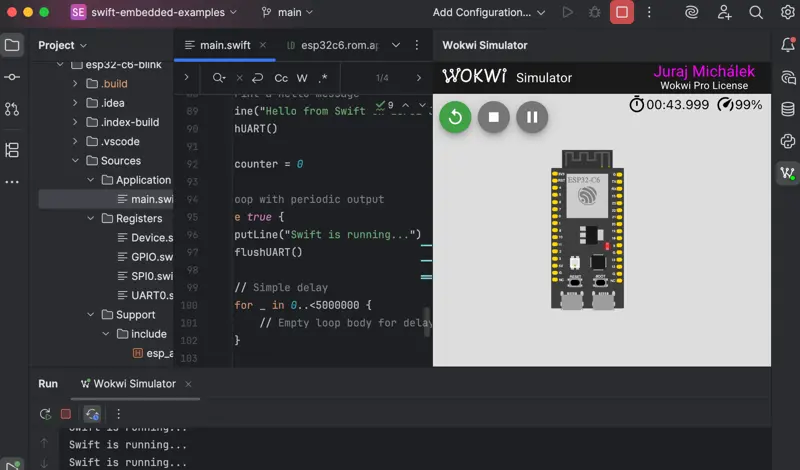

# ESP32-C6 Bare Metal Swift Console Example

This project demonstrates **Embedded Swift** running bare metal on the ESP32-C6 RISC-V microcontroller. It showcases console output using ESP32 ROM UART functions, proving that Swift can run efficiently on resource-constrained embedded systems without an operating system.

## What it does

The application:
- Runs bare metal Swift code on ESP32-C6 (RISC-V architecture)
- Outputs "Hello from Swift on ESP32-C6!" to the console
- Continuously prints status messages every few seconds
- Uses ESP32 ROM UART functions for reliable console communication

## Architecture Overview

This project is composed of several key components:

### 1. **Swift Application Layer**
- **`Sources/Application/main.swift`**: Main Swift application with console output functions
- Uses `@_cdecl("swift_main")` to provide C-compatible entry point
- Implements UART communication using ESP32 ROM functions

### 2. **Hardware Abstraction Layer**
- **`Sources/Registers/`**: Generated MMIO register definitions for ESP32-C6 peripherals
- **`Sources/Support/`**: C support code and linker scripts
- Uses Apple's [swift-mmio](https://github.com/apple/swift-mmio) library for type-safe hardware access
- Uses Espressif [SVDs](https://github.com/espressif/svd)
- Uses ESP-RS [ESP-HAL linker scripts](https://github.com/esp-rs/esp-hal/tree/main/esp-hal/ld/esp32c6)

### 3. **Build System**
- **Embedded Swift**: Uses Swift's experimental embedded mode (`-enable-experimental-feature Embedded`)
- **RISC-V Target**: Compiles for `riscv32-none-none-elf` architecture
- **Custom Linker Scripts**: ESP32-C6 specific memory layout and ROM function mapping
- **Makefile-based**: Simple build system for embedded development

### 4. **Console Communication**
The project demonstrates two approaches to UART communication:
- **ESP32 ROM Functions** (current implementation): Uses proven ROM UART functions
- **Direct Register Access**: Alternative using generated MMIO register definitions

## Technical Details

### Memory Layout
- Uses ESP32-C6 specific linker scripts in `Sources/Support/ld/esp32c6/`
- Maps Swift code to appropriate memory regions
- Links against ESP32 ROM functions for UART operations

### Swift Embedded Features
- **No Standard Library**: Bare metal environment without Foundation/stdlib
- **No Garbage Collector**: Manual memory management suitable for embedded systems
- **Whole Module Optimization**: Optimized for size and performance
- **Static Linking**: Everything compiled into a single binary

### Hardware Requirements
- ESP32-C6 development board (ESP32-C6-DevKitC-1 recommended)
- USB cable for programming and console output
- Computer with ESP-IDF tools installed

## Build Requirements

- **Swift 6.2 nightly** or later with Embedded Swift support
- **ESP-IDF tools** for flashing and monitoring
- **RISC-V GCC toolchain** (included with ESP-IDF)


## Building and Running

### Build the project:
```bash
make
```

### Convert to flashable format:
```bash
make elf2image
```

### Flash to ESP32-C6:
```bash
make flash
```

### Monitor console output:
```bash
espflash monitor
```

Expected output:
```
Hello from Swift on ESP32-C6!
Swift is running...
Swift is running...
Completed 10 iterations, continuing...
```

## Simulation Support

This project includes **Wokwi Simulator** support for testing without physical hardware:

1. Install [Wokwi Simulator plugin](https://plugins.jetbrains.com/plugin/23826-wokwi-simulator) for CLion
2. Open the project and run simulation
3. View console output in the simulator



## Project Structure

```
esp32-c6-blink/
├── Sources/
│   ├── Application/
│   │   └── main.swift              # Main Swift application
│   ├── Registers/
│   │   └── UART0.swift            # Generated UART register definitions
│   └── Support/
│       ├── include/               # C headers
│       ├── ld/                    # Linker scripts
│       └── esp_app_desc.c         # ESP32 app descriptor
├── Makefile                       # Build system
├── Package.swift                  # Swift package definition
├── esp32-c6-elf.json            # Embedded Swift compiler configuration
└── README.md                      # This file
```

## Key Technologies

- **[Embedded Swift](https://github.com/swiftlang/swift/tree/main/docs/EmbeddedSwift)**: Swift's embedded compilation mode
- **[Swift MMIO](https://github.com/apple/swift-mmio)**: Type-safe hardware register access
- **ESP32-C6**: RISC-V based microcontroller with WiFi/Bluetooth
- **Bare Metal**: No operating system, direct hardware control
